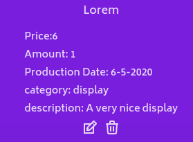

# Introduction
This is a repository with my product list project.
It consists of 2 parts:
1. an API which sends queries to a mongoDB database
2. a frontend in react where the data is displayed

The following README is an instruction on how to make them both work. 
It will also go into details of how they work in thelater sections.

# table of contents
- [API](#API)
    - [setup (how to install)](#setup)
        - [setting up mongoDB](#setting-up-mongodb)
        - [running the API](#running-the-api)
    - how it works
        - [available endpoints](#available-endpoints)
        - [mongodb schema](#mongodb-schema)
            - [data types inside the Product schema](#mongodb-schema)

- [React](#React)
    - [setup (how to install)](#react)
    - [Use of the app](#use)
    - [About API and redux store](#the-redux-store-and-the-api-calls)

# API
## setUp
In order to make this API work, you need to:
1. run mongoDB on your machine
2. run this API on your machine

### setting up MongoDB:
The mongodb setup is described by the following parameters:

    host: '127.0.0.1',
    port: 27017
this port is a default parameter when installing mongodb.

The connection port is described in 
>const dbData

in file app.ts in folder API.
If you have mongoDB installed with different port, you can change the port parameter to your configuration.

When running this app, it will create a database called 'products'.
If this databse already exists, it will connect to it.

In this readme I will not describe connecting to mongodb in detail, since it is dependent on your machine's setup. In my case, I run mongodb on a dockerized mongodb container but it should also work when mongodb is installed directly on your system. 

If you have docker installed and want to run mongoDB via dockerized container, you can run command:
>docker container run --name mongodb -d -p 27017-27019:27017-27019 mongo:4.4.9

### running the API:
This api will only work when mongodb is running!

In order to run it, navigate to the API folder in your terminal. 
When you are in the API folder, first run command 
>npm install

in order to install required depencies for the API to run. When that is done, run

>npm run dev

It will run the dev version of the API which is enough to connect to the database. 
If you want to compile this API from TypeScript to JavaScript, run

>npm run build

In order to run this API with compiled JavaScript code, 
(after compiling with previously mentioned command) run:
>npm run start

This API runs on port 5000 so make sure that it is not occupied by any other application.
## available endpoints
This is a typical REST API with following endpoints:
- GET 
    - available on route 
    > localhost:27017/products
    - returns an array called allProducts, that contains every item in the database
    
- POST
    - add new item to database
    - available on route 
    > localhost:27017/products/add
    - accepts body with following parameters:
        - name,
        - price,
        - amount,
        - prodDate,
        - category,
        - description
    you can read more on those parameters in [mongoDB schema](#mongodb-schema) section
    - returns the body of the request on succesful query 
- PUT
    - edit an item with given id
    -available on route 
    > localhost:27017/products/:id/edit
    - accepts body containing following parameters:
        - name,
        - price,
        - amount,
        - prodDate,
        - category,
        - description
    you can read more on those parameters in [mongoDB schema](#mongodb-schema) section, however, in
    this case, none of them are neccesary
    -returns the item that has just been edited

- DELETE
    - delete an item with given id
    - available on route 
    > localhost:27017/products/:id
    - returns the body of the item that has just been deleted

## mongoDB schema
This API uses express.js and mongoose, which is a JavaScript package that allows an express app to connect to a mongoDB database. It also introduces some level of data validation on the backend side.

MongoDB schemas represent a form of an object that will be added to the database. 

This API contains only one schema called 'Product'. It contains following fields:
 - name
 - price
 - amount
 - prodDate
 - category
 - description

All of which are required besides description.
If an example POST query would not contain one of the required fields or would contain incorrect data, the API would stop working and thus would not allow this data to be added to the database.  

### Data types inside the Product schema

*  Name
    
    - a string no longer than 100 characters. Required.
* Price
    - a positive number. Required
* Amount 
    - a positive integer. Required
* prodDate
    - Production date. Required
* category
    - This field is an enum, which means it will only accept certain predetermined values. In this case they are "smartphones","laptops" or "displays". Required
* description
    -   an optional field allowing a string no longer than 200 characters

# REACT
Running react app is easier than running the API since it doesn't require any programs installed on your computer except node.js and npm.
It connects to the database, so make sure to run it first!

In order to run react app, navigate in terminal to 
'/products' folder.
When inside, first install any required dependencies by using command:
>npm install

now when the node_modules folder has appeared, you can run:
>npm run

Your app should be running on port 3000 on localhost.

## Use

This app allows you to use all the available routes in the api. It first loads data from the API and then stores it in a redux store. All actions taken in this app affect both the store state and the database. 

### adding items

You can add items by clickng the 'Add items' button.
Clicking it will navigate you to the add form.
There you will be able to submit all the required data.
You will not be able to submit a form which was filled out incorrectly. 

### editing and deleting items

Hovering on an item will display its details. From there, you will also have access to edit and delete buttons. 

Clicking the edit button will lead you to the same form as with the add options. 
Clicking the trash icon will remove the item.  

## The redux store and the API calls
This app first loads data from API using axios. Then, when the data is loaded, it is dispatched to a reducer with ADD_ITEM action.

Each edit and delete also makes an API call and dispatches an adequate action, so for example, when you edit an item, you edit it both in the database and in the store.

